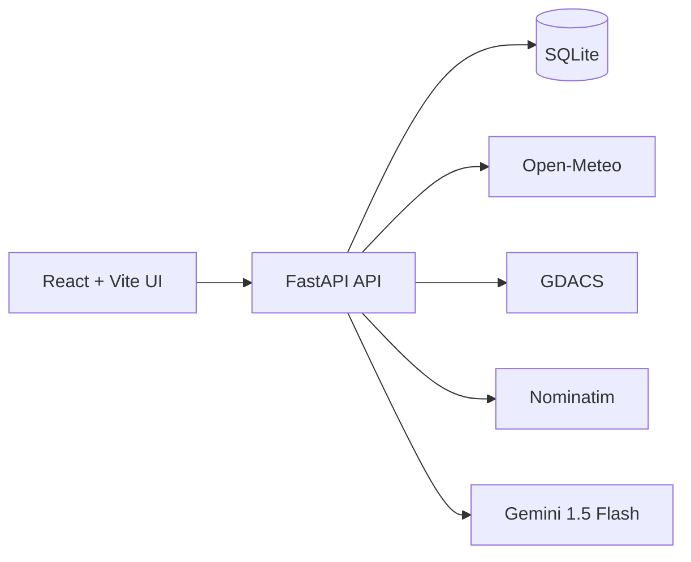

# OculusIQ - Freight Intelligence Platform

OculusIQ is an operations-grade supply chain intelligence system for freight forwarders and mid-market exporters. It turns fragmented shipping data into a single command view: where cargo is, what is at risk, and what to do next.

If your day is spent reconciling carrier portals, email threads, and client follow-ups, OculusIQ is built to replace that chaos with a portfolio view and an action plan.

## What It Is For

- Freight forwarders managing 20-200 SME clients.
- Exporters shipping 500-5,000 containers per year.
- Operations teams that need proactive disruption detection and faster client communication.

## What It Can Do

- Show all cargo across clients in one command map.
- Detect disruption signals, quantify risk, and flag at-risk shipments.
- Run what-if scenarios with a working Scenario Planner.
- Create and persist clients, shipments, ports, and routes in the database.
- Ingest external risk events (GDACS) and surface them on the map.
- Import shipments by CSV with validation and optional Nominatim geocoding.
- Execute on-demand intelligence scans and save the results.


## Live vs Simulated Data

| Data | Source | Live | Notes |
| --- | --- | --- | --- |
| Weather | Open-Meteo | Yes | Used in risk scoring |
| External risks | GDACS | Yes | Public feed, no key |
| Geocoding | Nominatim | Yes | Optional, rate limited |
| Port congestion | Simulated | No | Labeled as simulated |
| Shipments, clients, ports, routes | SQLite | Yes | DB-backed create APIs |
| AI copilot | Gemini | Optional | Fallback responses if no key |

## Product Tour

- Operations Command Map: unified view of cargo, ports, routes, and external risks.
- Cargo Portfolio: filter shipments by client, lane, carrier, and status.
- Intelligence Center: run scans, detect anomalies, and review external risks.
- Scenario Planner: simulate disruptions and quantify the impact.
- Client Onboarding: add a client with cargo details in a guided wizard.

## Architecture



## Repository Structure

```text
OculusIQ/
	backend/
		core/            # config, models, db, scheduler
		routers/         # API endpoints
		services/        # risk, simulation, intelligence, geocoding
		data/            # seed data
	frontend/
		src/
			api/           # API client
			components/    # UI building blocks
			pages/         # screens
	.gitignore
	README.md
	start.bat
	start.sh
```

## Quick Start

- Windows: `start.bat`
- macOS/Linux: `./start.sh` (ensure it is executable)

### Backend (manual)

```powershell
Set-Location backend
..\.venv\Scripts\python.exe -m pip install -r requirements.txt
..\.venv\Scripts\python.exe -m uvicorn main:app --reload --port 8000
```

### Frontend (manual)

```powershell
Set-Location frontend
npm install
npm run dev
```

## Environment Variables

Create `backend/.env` only if you want live AI or to override defaults. Use `backend/.env.example` as a template.

```
GEMINI_API_KEY=your_key_here
DATABASE_URL=sqlite+aiosqlite:///./data/shipments.db
PORT=8000
OPEN_METEO_BASE=https://api.open-meteo.com/v1
NOMINATIM_BASE=https://nominatim.openstreetmap.org
NOMINATIM_USER_AGENT=OculusIQ/0.1 (contact: you@example.com)
```

## CSV Import Schema

```
shipment_id, client_name, origin_city, origin_country, dest_city, dest_country,
carrier, mode, status, eta, cargo_type, cargo_value_usd, weight_kg, bl_number,
po_number, incoterm, hs_code, container_number
```

Computed fields (risk score, coordinates, waypoints) are generated after import.

## API Base

`http://localhost:8000/api/v1`

## Key Endpoints

- `GET /health`
- `GET /health/feeds`
- `POST /clients`
- `POST /shipments`
- `POST /ports`
- `POST /routes`
- `GET /clients/sla-overview`
- `POST /intelligence/scan`
- `GET /intelligence/scans/latest`
- `GET /intelligence/external-risks`
- `POST /documents/import-csv`
- `GET /documents/template`
- `PATCH /shipments/{shipment_id}`
- `POST /simulation/run`

## Operational Notes

- SQLite has no migrations in this MVP. After model changes, delete:
	- `backend/data/shipments.db`
	- `backend/data/shipments.db-wal`
	- `backend/data/shipments.db-shm`
- `/copilot` and `/settings` redirect to `/`.
- `/ports` redirects to `/map` (Operations Command Map).

## Deployment Notes

- Frontend API base can be set with `VITE_API_BASE`.
- SQLite is for local MVP usage. Use a managed DB for production.

## Verification

```
python -m compileall backend
npm run build
```
